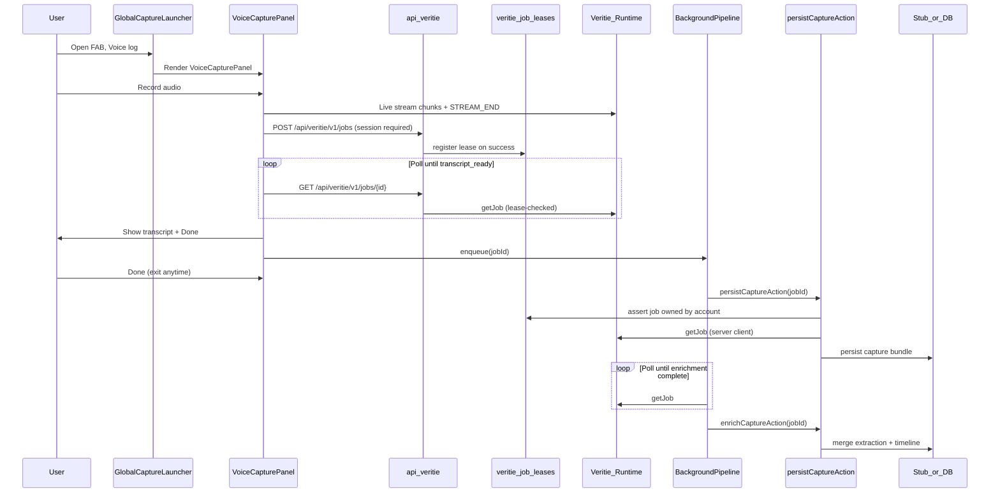

# Capture flow

End-to-end voice capture from launcher to persist (stub or database).

## Sequence

## Auth boundaries

| Path | Gate |
| --- | --- |
| `POST/GET /api/veritie/v1/*` | `requireUser()` → 401; same-origin defense-in-depth |
| `POST /jobs` | Registers `veritie_job_leases` row for `(jobId, accountId, userId)` |
| `GET /pipeline/config` | Session required; no job lease (pipeline display bundle) |
| `GET /jobs/:id`, `POST /jobs/:id/upload-finalize` | 403 unless lease exists for current account |
| `persistCaptureAction` / `POST /api/captures` | Session required; lease ownership before `getJob` |
| Duplicate persist | Partial unique index on `(account_id, veritie_job_id)` |

## Key files

| Layer | File |
| --- | --- |
| Launcher shell | `components/capture/GlobalCaptureLauncher.tsx` |
| SDK wiring | `components/capture/VoiceCaptureLauncherPanel.tsx` |
| Recording + upload UI | `components/capture/VoiceCapturePanel.tsx` |
| Transcript readiness | `lib/capture/transcript-readiness.ts` |
| Background persist/enrich | `lib/capture/capture-background-pipeline.ts` |
| Veritie proxy | `app/api/veritie/v1/[...path]/route.ts` |
| Job lease registry | `lib/veritie/register-job-lease.ts`, `lib/db/repositories/veritie-job-leases.ts` |
| Server Veritie client | `lib/veritie/server-client.ts` |
| Persist | `lib/capture/persist-capture-from-job.ts` |
| Job → stub mapping | `lib/capture/map-veritie-job.ts` |
| Extraction schema + aspect derivation | `docs/contracts/voice-log-extraction-schema.md`, `lib/capture/extraction-aspect.ts` |
| Script persist API | `app/api/captures/route.ts` |

## Out of scope (follow-up)

- SSE-based background enrichment (polling only)
- Per-user rate limiting on job create (Phase 6 stretch)
- Full CSRF token strategy beyond same-origin + session
