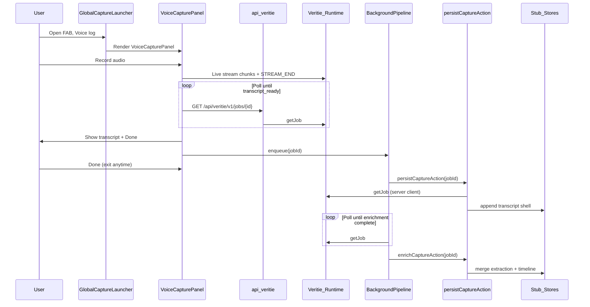

# Capture flow

End-to-end voice capture from launcher to stub persist.

## Sequence

## Key files

| Layer | File |
| --- | --- |
| Launcher shell | `components/capture/GlobalCaptureLauncher.tsx` |
| SDK wiring | `components/capture/VoiceCaptureLauncherPanel.tsx` |
| Recording + upload UI | `components/capture/VoiceCapturePanel.tsx` |
| Transcript readiness | `lib/capture/transcript-readiness.ts` |
| Background persist/enrich | `lib/capture/capture-background-pipeline.ts` |
| Veritie proxy | `app/api/veritie/v1/[...path]/route.ts` |
| Server Veritie client | `lib/veritie/server-client.ts` |
| Persist | `lib/capture/persist-capture-from-job.ts` |
| Job → stub mapping | `lib/capture/map-veritie-job.ts` |
| Script persist API | `app/api/captures/route.ts` |

## Out of scope (this branch)

- Database persistence (stub stores only)
- Session auth on proxy or persist paths
- SSE-based background enrichment (polling only)
