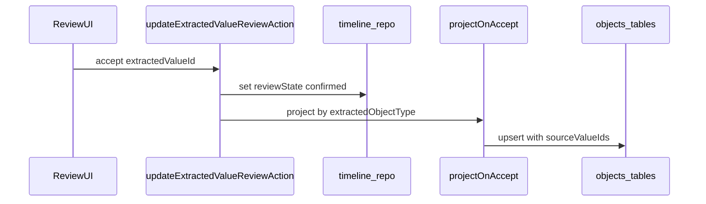
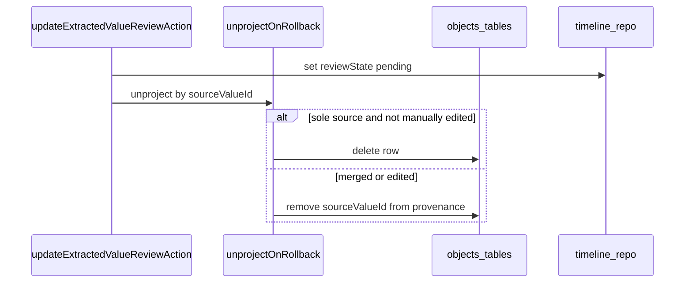

# Architecture — Domain Projection and Capture Surfaces

## Purpose

Technical reference for projecting accepted timeline items into domain entities, capture profile wiring, and read-model views (lists, habits, timebox). Complements the planning doc: [`docs/planning/2026-08-07-domain-projection-and-capture-surfaces-plan.md`](../planning/2026-08-07-domain-projection-and-capture-surfaces-plan.md).

## Scope

**Covered:**

- Accept/rollback projection flow and provenance
- Per-type projection rules from `extracted_values` to `db/schema/objects.ts` tables
- Reminder push delivery responsibilities after reminder projection
- Capture profiles (multi-schema Veritie) and app wiring points
- View read models that do not add domain tables

**Not covered:**

- Veritie schema JSON for `PersonalBraindump` and other profiles (owned by Veritie + `docs/contracts/` when published)
- Capture completion job queue (see [`2026-08-07-capture-completion-job-queue-plan.md`](../planning/2026-08-07-capture-completion-job-queue-plan.md))
- End-to-end capture ingest sequence (see [`capture-flow.md`](capture-flow.md))

## Components

| Component | Responsibility | Key files |
| --- | --- | --- |
| Review UI | Accept, reject, rollback, inline edit | `components/extraction/ExtractedValueInlineReviewActions.tsx` |
| Review transitions | State machine guards | `lib/capture/extracted-value-review-transitions.ts` |
| Review mutation | Server action entry | `lib/actions/stub-data-mutations.ts` |
| Timeline repo | Updates `reviewState` on `extracted_values` + `timeline_events` | `lib/db/repositories/timeline.ts` |
| Projector _(planned)_ | Maps confirmed `extracted_value` → domain row | `lib/capture/project-on-accept.ts` _(new)_ |
| Domain repos _(planned)_ | Insert/update/delete projected rows | `lib/db/repositories/tasks.ts`, etc. |
| Reminder delivery _(planned)_ | Claims due reminders and sends Web Push notifications | Worker/queue module _(new)_ |
| Push subscription API _(planned)_ | Stores per-user/device Push API subscriptions | Route + repository _(new)_ |
| Job mapper | Veritie job → capture bundle | `lib/capture/map-veritie-job.ts` |
| Pipeline config | Schema-driven list keys and object types | `lib/capture/pipeline-config.ts` |
| Capture launcher | Profile selection, lease prep | `components/capture/GlobalCaptureLauncher.tsx` |
| Lease context | Pipeline config fetch, `prepareCapture` | `components/capture/VeritieCaptureLeaseContext.tsx` |

## Part A — Domain projection

### Sequence



On rollback (`confirmed` → `pending`):



### Entry points (current)

| Path | Handler |
| --- | --- |
| UI inline actions | `ExtractedValueInlineReviewActions` → `updateExtractedValueReviewAction` |
| API | `POST /api/extracted-values/review` → same mutation |

Projection should run inside the same transaction as `updateExtractedValueReviewState` when `nextState === "confirmed"`, and on rollback when reverting to `pending`.

### Provenance

Domain tables in `db/schema/objects.ts` carry:

- `source_capture_ids: string[]`
- `source_value_ids: string[]`

On project:

1. Read `extracted_values` row (`object_type`, `fields`, `aspect`, `capture_id`).
2. Insert or update domain row.
3. Append `extracted_value.id` to `source_value_ids` and `capture_id` to `source_capture_ids`.

Store a back-link if needed for rollback lookups (e.g. `projected_entity_type` + `projected_entity_id` on `extracted_values`, or a `projection_links` table). Choose one approach in implementation; rollback must resolve domain row from `sourceValueId`.

### Per-type projection rules

Mapping uses flat candidate fields in `extracted_values.fields` (see [`docs/contracts/voice-log-extraction-schema.md`](../contracts/voice-log-extraction-schema.md)).

| `extractedObjectType` | Domain table | Field mapping (indicative) | Resolution required |
| --- | --- | --- | --- |
| `task` | `tasks` | `title` ← title; `dueAt` ← due_at; `priority` ← priority; `aspect` ← aspect; `notes` ← source_quote | Optional `listId` from `profileContext` or post-accept assign |
| `reminder` | `reminders` | `title`, `remindAt` ← remind_at, `recurrence`, `aspect` | Push readiness prompt if no active subscription |
| `money_entry` | `money_entries` | `amount`, `currency`, `merchantOrPayee`, `category`, `occurredAt`, `aspect` | — |
| `goal` | `goals` | `title`, `targetType`, `targetValue`, `unit`, `cadence`, `aspectIds` | — |
| `goal_progress` | `goal_progress_entries` | `valueDelta`, `valueSnapshot`, `note`, `occurredAt` | **Goal picker** → `goalId` |
| `record` | `records` | `title`, `kind`, `markdownContent`, `aspect` | New vs append prompt |
| `resource` | `resources` | `name`, `category`, `summary`, `aspectIds` | Dedup/merge by name |
| `event` | _(deferred)_ | Interim: `reminders` or `tasks.scheduledFor` | — |

Default status values on create (implementation detail):

- `tasks.status`: `todo`
- `reminders.status`: `active`
- `money_entries.status`: `confirmed`
- `goals.status`: `active`

### Reminder delivery

Projection creates the reminder entity; delivery is a separate durable background concern.

| Concern | Rule |
| --- | --- |
| Scheduling | Due reminders are claimed server-side from durable state; no client timer can be required for delivery |
| Push transport | Use the existing PWA service worker as the client receiver, plus stored Web Push subscriptions per user/device |
| Delivery records | Persist last attempt, last success, failure reason, delivered/dismissed/snoozed state, and next recurrence run |
| Permission state | `/reminders` owns the user-facing prompt/readiness UI; projector must not block accept on missing permission |
| Fallback | Denied/unavailable push leaves reminders active and visible as overdue in `/reminders` and `/today` |
| Rollback | If rollback deletes the projected reminder row, cancel pending delivery; if provenance is only removed, keep delivery tied to the surviving row |

Worker behavior should follow the same Postgres-backed claim/retry/idempotency model documented for capture completion jobs. A shared queue abstraction is acceptable after the capture queue is implemented; otherwise use a sibling reminder delivery table with the same lease/backoff conventions.

### `goal_progress` resolution

Before projection:

1. Load active goals for account (filter by aspect lens optional).
2. Present goal picker UI (timeline accept sheet or inline).
3. Pass selected `goalId` into projector.
4. Insert `goal_progress_entries` row; update `goals.currentValue` when `valueDelta` or `valueSnapshot` present.

Fuzzy title match may pre-select a goal in the UI; user must confirm.

### Rollback invariants

| Condition | Domain action |
| --- | --- |
| Row's `source_value_ids` is exactly `[thisValueId]` and row unchanged since project | Delete domain row |
| Row has multiple `source_value_ids` | Remove this id from array only |
| User edited domain row after project | Remove provenance link; keep row |
| `reviewState` was `edited` | Rollback via review actions blocked today; domain row unchanged |

## Part B — Capture profiles

### Profile registry

| Profile ID | Veritie schema | Pipeline config cache key includes profile |
| --- | --- | --- |
| `voice_log` | `PersonalVoiceCapture` | `voice_log` |
| `braindump` | `PersonalBraindump` | `braindump` |
| `journal` | `PersonalJournal` | `journal` |
| `task_list` | `PersonalTaskList` | `task_list` |
| `meeting` | `PersonalMeeting` | `meeting` |

Today the app uses a single `pipelineAlias: "proxy"` and one config cache key (`lib/capture/pipeline-config-service.server.ts`). Multi-profile requires:

1. Profile → pipeline alias or schema binding configuration.
2. Cache key: `{apiUrl}|{alias}|{profile}`.
3. Client: `VeritieCaptureLeaseContext` loads config for active profile when launcher opens a mode.

### Job metadata

Extend `buildCaptureJobMetadata` (`lib/capture/build-capture-job-metadata.ts`) with:

```typescript
{
  capture_profile: "braindump" | "voice_log" | ...;
  profile_context?: {
    list_id?: string;
    aspect?: string;
  };
}
```

Veritie schemas may use metadata to tune extraction. App persists `captures.profile` and `captures.profileContext` on persist (`lib/capture/map-veritie-job.ts`, `lib/db/repositories/captures.ts`).

### Mapper behavior per profile

`mapVeritieJobToCaptureBundle` already accepts `PipelineExtractionConfig` derived from pipeline config entities list. Per profile:

| Profile | `extractionListKeys` | Timeline events created | Default review surface |
| --- | --- | --- | --- |
| `voice_log` | All entity lists | All `*_detected` types | `/timeline` |
| `braindump` | `fragments` or none | Suppressed from default timeline feed | `/captures/[id]` |
| `journal` | Minimal / single entry | Low noise | `/captures/[id]` |
| `task_list` | `tasks` only | `task_detected` only | `/timeline` |
| `meeting` | `summary`, `tasks`, `decisions` | Mixed | `/captures/[id]` + timeline |

Suppress braindump items via `lib/domain/timeline-filters.ts` (same pattern as hiding `capture_created` / `extraction_completed`).

### Braindump accept paths

| Action | Result |
| --- | --- |
| Bulk save as record | One `records` row (`kind: note`), markdown from transcript or `content` field |
| Accept fragment | Project single fragment as `task` if schema emits structured fragments |
| Reject | No domain row |

### Task-list profile

When `profileContext.listId` is set:

1. Launcher opened from list detail or "Add to list" action.
2. Metadata carries `list_id`.
3. On `task` projection, set `tasks.listId` automatically.

## Part C — View read models

These surfaces query existing tables; no projection on accept beyond parent entity rules.

### List checklist

```
SELECT * FROM tasks
WHERE account_id = ? AND list_id = ? AND status != 'done'
ORDER BY created_at
```

Route options: `/tasks?list={listId}` or `/lists/{listId}`. UI: checkable rows; complete = `tasks.status = 'done'`.

### Habit tracker

```
SELECT * FROM goals
WHERE account_id = ? AND target_type = 'habit' AND status = 'active'
```

Streak: compute from `goal_progress_entries.occurred_at` grouped by `cadence`. Multi-aspect: filter where `aspect_ids` overlaps active lens (`lib/aspect-lens`).

### Timebox grid

For a given calendar day:

```
SELECT * FROM tasks
WHERE account_id = ?
  AND scheduled_for >= dayStart AND scheduled_for < dayEnd
ORDER BY scheduled_for
```

Drag-and-drop writes `scheduled_for` and `scheduled_duration_min`. Does not create timeline events.

### Today

Composes:

- Tasks due or scheduled today
- Active reminders for today
- Overdue reminders that were not delivered, dismissed, or snoozed
- Events (when table exists)
- Optional timebox grid section

## Boundaries

| Boundary | Rule |
| --- | --- |
| Timeline vs domain | Timeline holds review state; domain holds actionable truth after accept |
| Capture vs profile | `captures.type` = media; `captures.profile` = extraction schema selection |
| Entity vs view | Views never receive `source_value_ids`; only projected entities do |
| Veritie vs app | Classification in Veritie; projection and provenance in app |
| Stub vs backend | Projection must run in backend path; stub mode may mirror for dev |

## Invariants

1. A confirmed `extracted_value` with a supported `object_type` has at most one primary projected domain row per type-specific rules (except append-to-record flows).
2. `source_value_ids` on a domain row must reference valid `extracted_values` for the same account.
3. Rollback to `pending` must not leave orphan domain rows when the row was solely created from that value.
4. `goal_progress` projection never proceeds without a resolved `goalId`.
5. Capture profile determines pipeline config and review surface defaults, not `CaptureType`.
6. Reminder delivery does not depend on an open browser tab after the reminder is stored.

## Non-goals

- Autonomous accept without user action.
- Real-time sync to external calendars.
- Many-to-many task ↔ list membership in initial list implementation.
- Re-classification of entities in-app (Veritie owns extraction; user edits fields).

## References

- Planning: [`docs/planning/2026-08-07-domain-projection-and-capture-surfaces-plan.md`](../planning/2026-08-07-domain-projection-and-capture-surfaces-plan.md)
- Capture flow: [`capture-flow.md`](capture-flow.md)
- Extraction contract: [`docs/contracts/voice-log-extraction-schema.md`](../contracts/voice-log-extraction-schema.md)
- Review transitions: `lib/capture/extracted-value-review-transitions.ts`
- Object schema: `db/schema/objects.ts`
- Capture schema: `db/schema/capture.ts`
