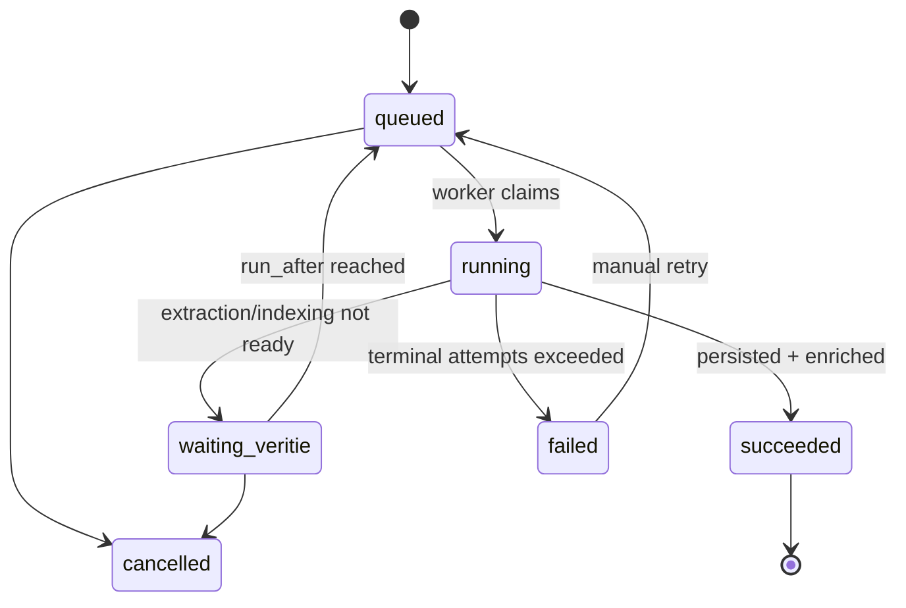

# Capture Completion Job Queue Plan

Date: 2026-08-07

## Summary

Voice capture must not depend on the browser staying open after the transcript is ready. The durable target is a database-backed job queue for capture completion, with a worker loop that persists the capture, waits for Veritie extraction/indexing, merges extracted values and timeline events, and records terminal state.

Preferred path: build the DB-backed queue first inside the app runtime, then move the runner to a separate worker process only when operational needs justify it. This gives durable state, retries, idempotency, and observability without introducing a second deployable before the data model is proven.

## Problem

The current capture experience correctly shows transcript ASAP and lets the user leave the voice capture panel while extraction/indexing continues. The weak point is ownership of the post-transcript work:

- Browser-owned background work stops when the tab closes, the app is killed, or the device sleeps.
- Next `after()` improves server-side handoff, but it is still tied to request/runtime lifetime and platform `waitUntil` support.
- Capture completion needs durable retry and recovery semantics because it creates user-visible timeline items and extracted values.

## Target outcome

After transcript readiness, the client only needs to enqueue durable completion work. From that point onward, completion must finish without the browser:

1. Persist transcript capture shell.
2. Preserve/stitch job-scoped audio if voice audio saving is enabled.
3. Poll or resume once Veritie extraction/indexing completes.
4. Merge extraction payload, evidence index, extracted values, and timeline events.
5. Record success/failure and expose retry.

## Recommendation

Use a Postgres-backed queue table as the source of truth. Run jobs from the Next server initially using a guarded runner, then graduate to a dedicated worker process when needed.

Do not start with an external queue unless we already need multi-process throughput or cross-service fanout. Postgres is already the persistence boundary for account/job ownership and captures, and the volume of voice capture completions is expected to be modest.

## Data model

Add `capture_completion_jobs`.

| Column | Purpose |
| --- | --- |
| `id` | Stable queue id, e.g. `capture_completion_<uuid>` |
| `account_id` | Tenant isolation and query scope |
| `user_id` | Actor/provenance |
| `veritie_job_id` | Veritie job to complete; unique for active completion |
| `capture_id` | Filled after persist succeeds |
| `status` | `queued`, `running`, `waiting_veritie`, `succeeded`, `failed`, `cancelled` |
| `attempt_count` | Retry accounting |
| `max_attempts` | Default 5 |
| `run_after` | Backoff / delayed polling |
| `locked_at` | Worker lease timestamp |
| `locked_by` | Worker identity |
| `last_error` | Human/debug error summary |
| `metadata` | JSON for save-audio flag, transcript-ready timestamp, source route |
| `created_at` / `updated_at` / `completed_at` | Audit and monitoring |

Indexes:

- Unique `veritie_job_id` where `status` is not terminal, or globally unique if one completion per job is always correct.
- `(status, run_after)` for worker claiming.
- `(account_id, created_at desc)` for account-visible diagnostics.

## State machine



Rules:

- `queued`: eligible when `run_after <= now`.
- `running`: short lease; if `locked_at` expires, another worker can reclaim.
- `waiting_veritie`: non-error state for jobs where transcript exists but extraction/indexing is still pending.
- `failed`: only after retry budget is exhausted or a non-retryable ownership/auth/schema error occurs.
- `succeeded`: capture and enrichment merge are complete.

## Idempotency

The queue runner must be safe to execute multiple times for the same Veritie job.

Existing behavior helps:

- `persistCaptureFromVeritieJob(jobId)` detects duplicate captures by Veritie job id.
- `enrichCaptureFromVeritieJob(jobId)` merges deterministic extracted value and timeline ids.
- Veritie job leases already enforce account ownership.

Required additions:

- Queue enqueue should upsert by `veritie_job_id`.
- Worker should persist `capture_id` after the first successful persist.
- Manual retry should clear `last_error`, increment neither capture ids nor timeline ids, and re-run merge.

## Worker design

Phase 1 runner can live in-process:

- Claim one or more rows with `status in ('queued', 'waiting_veritie')`, `run_after <= now`, and expired/no lock.
- Use a transaction with row locking to prevent double claims.
- Process each job outside the claim transaction.
- Update status and backoff after each step.

Claim pseudocode:

```sql
select id
from capture_completion_jobs
where status in ('queued', 'waiting_veritie')
  and run_after <= now()
  and (locked_at is null or locked_at < now() - interval '2 minutes')
order by run_after asc, created_at asc
limit 10
for update skip locked;
```

Processing steps:

1. Mark `running`, set `locked_at`, `locked_by`, increment `attempt_count`.
2. Call `persistCaptureFromVeritieJob(veritie_job_id)`.
3. Poll Veritie once or a small bounded number of times.
4. If extraction/indexing is pending, mark `waiting_veritie` with `run_after = now + interval '15 seconds'`.
5. If ready, call `enrichCaptureFromVeritieJob(veritie_job_id)`.
6. Mark `succeeded`.
7. On retryable errors, set exponential backoff.
8. On terminal errors, mark `failed`.

## API contract

Replace the current non-durable completion handoff with a durable enqueue endpoint:

`POST /api/captures/jobs/:jobId/complete`

Behavior:

- Session-authenticated.
- Validates job id.
- Verifies `veritie_job_leases` ownership.
- Upserts a `capture_completion_jobs` row.
- Returns `202 { ok: true, jobId, completionJobId, status }`.
- Optionally nudges the in-process runner with `after()` as an optimization, not the durability mechanism.

The client should treat a successful `202` as handoff complete. UI can continue to subscribe/poll for updates, but correctness no longer depends on it.

## UI behavior

Voice panel:

- Continue showing transcript immediately.
- Call enqueue endpoint after transcript readiness.
- If enqueue fails, show a retryable warning because completion is not yet durable.
- If enqueue succeeds, allow the user to close the panel without caveats.

Captures/timeline surfaces:

- Show capture as `processing` until the completion job succeeds.
- Show a recoverable error state if completion job fails.
- Provide a manual retry action for failed completion jobs.

## Observability

Add admin/debug visibility before scaling:

- Count by status.
- Oldest queued/waiting job age.
- Failed jobs with `last_error`.
- Attempt counts and retry schedule.
- Capture completion duration from transcript readiness to success.

Log events:

- `completion.enqueue`
- `completion.claim`
- `completion.persisted`
- `completion.waiting_veritie`
- `completion.enriched`
- `completion.failed`
- `completion.retried`

## Phased implementation

### Phase 0: Current bridge

Keep the `after()` handoff as a short-term improvement. It reduces browser dependency but is not the final durability story.

### Phase 1: DB queue

- Add schema and repository for `capture_completion_jobs`.
- Update complete endpoint to enqueue.
- Add repository tests for enqueue, claim, lease expiry, success, failure, retry.
- Keep the current client-side coordinator only as a live UI watcher.

### Phase 2: In-process runner

- Add a server runner that processes due jobs opportunistically via `after()` after enqueue and possibly on selected authenticated reads.
- Keep each run bounded.
- Ensure all processing is idempotent.

### Phase 3: Dedicated worker

Move the same runner into a separate process when needed:

- `npm run worker:capture-completions`
- Runs continuously with graceful shutdown.
- Uses the same claim/update repository.
- No client or route dependency.

### Phase 4: Operations

- Add failed-job retry UI.
- Add metrics/dashboard.
- Add alerting for stale queued jobs and repeated failures.

## Open questions

- Should completion jobs be account-visible to users, or only surfaced as capture/timeline status?
- What is the desired max completion latency after transcript readiness?
- Should failed completion jobs block capture detail display, or show transcript-only detail with retry?
- Should the worker poll Veritie, or should Veritie eventually call back via webhook when extraction/indexing completes?

## Non-goals

- Replacing Veritie extraction/indexing.
- Building a general-purpose queue for every app workflow immediately.
- Requiring an external queue service before capture completion volume proves it necessary.
