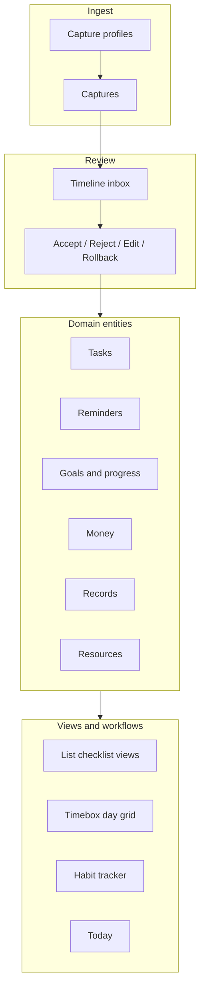
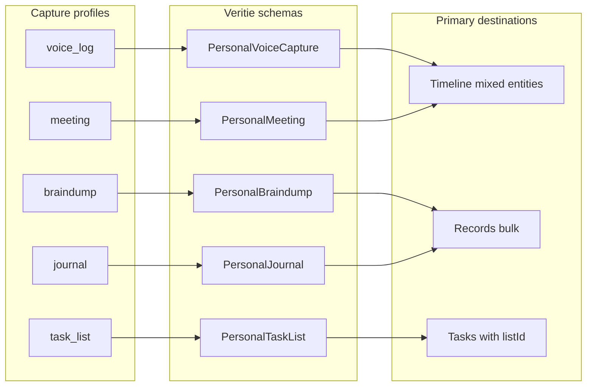

# Domain Projection and Capture Surfaces Plan

Date: 2026-08-07

## Summary

Close the gap between the capture → timeline → review pipeline and the Plan/Library routes. Today, accept/reject/rollback only updates `reviewState` on `extracted_values` and `timeline_events`; it does not create rows in projected domain tables (`tasks`, `reminders`, `goals`, `money_entries`, `records`, `resources`).

This plan defines:

- **Domain projection on accept** — confirmed timeline items become durable domain entities with provenance.
- **Subset surfaces** — list context on tasks, multi-aspect habits, timeboxing UI, and specialized capture profiles (braindump first).
- **Usable reminders** — reminders are not complete until they can notify the user while the PWA is closed.
- **Manual mapping before AI** — deterministic rules and resolution pickers; AI as optional suggestions later.

Architecture detail: [`docs/architecture/domain-projection-and-capture-surfaces.md`](../architecture/domain-projection-and-capture-surfaces.md)

## Relationship to other plans

| Plan | Relationship |
| --- | --- |
| [`2026-08-03-voice-log-personal-restructure-plan.md`](2026-08-03-voice-log-personal-restructure-plan.md) | Extends post-phase-6 work; does not supersede the restructure initiative |
| [`2026-08-07-capture-completion-job-queue-plan.md`](2026-08-07-capture-completion-job-queue-plan.md) | Complements capture durability; projection runs after extraction is persisted |
| [`docs/contracts/voice-log-extraction-schema.md`](../contracts/voice-log-extraction-schema.md) | General voice log schema; specialized profiles add sibling schemas in Veritie |

## Three-layer model



| Layer | Role |
| --- | --- |
| **Capture** | Voice/PDF/etc. ingestion via Veritie; one or more extraction schemas per capture profile |
| **Timeline** | Review inbox — pending, confirmed, rejected signals from captures |
| **Domain entities** | Durable, actionable state on Plan/Library routes |
| **Views/workflows** | Filtered or composed UI over entities (no new domain tables except `task_lists` registry) |

## Current gap

| Area | Today | Target |
| --- | --- | --- |
| Accept action | Sets `reviewState: "confirmed"` only | Also projects into domain table |
| Rollback | Sets `reviewState: "pending"` | Also un-projects domain row when safe |
| `/tasks` | Page shows placeholder `EmptyState`; read path exists | Unhide UI; tasks populated by projection |
| `/records` | Legacy compliance `objects` adapter | Personal `records` table + projection |
| Resources | Manual create via API works | `resource_detected` accept also projects |
| Goals, money, reminders | Schema only | Repos, routes, projection; reminders also need push delivery |

Key code today:

- Review UI: `components/extraction/ExtractedValueInlineReviewActions.tsx`
- Review transitions: `lib/capture/extracted-value-review-transitions.ts`
- Review mutation: `lib/actions/stub-data-mutations.ts` → `updateExtractedValueReviewAction`
- DB write (review state only): `lib/db/repositories/timeline.ts`
- Projected tables (designed, not wired): `db/schema/objects.ts`

## Domain entity map

| Route | Table | Stores | Route status |
| --- | --- | --- | --- |
| `/timeline` | `timeline_events` | Detected signals for review | Implemented |
| `/captures` | `captures`, `voice_logs`, `extracted_values` | Source captures and extraction tree | Implemented |
| `/tasks` | `tasks` | Actionable, completable work | UI stubbed; read repo exists |
| `/reminders` | `reminders` + push subscription/delivery tables | Time-triggered pings | Placeholder; delivery not wired |
| `/events` | _(none yet)_ | Calendar blocks | Placeholder; defer or absorb into reminders initially |
| `/goals` | `goals`, `goal_progress_entries` | Outcomes, habits, progress | Placeholder |
| `/money` | `money_entries` | Expenses, bills, income | Placeholder |
| `/records` | `records` | Durable knowledge, notes, checklists-as-docs | Route uses legacy `objects` adapter |
| `/resources` | `resources` | People, places, subscriptions, etc. | Most complete domain route |

Provenance on domain rows: `source_capture_ids` and `source_value_ids` JSON arrays on projected tables (`db/schema/objects.ts`).

## Entity vs view vs workflow

Use this decision tree before adding schema or routes:

```
Does it need accept/rollback provenance from timeline?
  NO  → view, workflow, or capture profile behavior
  YES → Is it composable from existing entities?
          YES → entity + metadata/tag (e.g. listId on task)
          NO  → new entity + extraction type + projection
```

| Thing | Classification | Storage |
| --- | --- | --- |
| Shopping / grocery list | **View** over tasks | `task_lists` + optional `tasks.listId` |
| Habit tracker | **View** over goals | `goals` with `targetType: habit`; `goal_progress_entries` |
| Timeboxing | **Workflow** over tasks | `tasks.scheduledFor` + `scheduledDurationMin` |
| Braindump | **Capture profile** | Bulk → `records`; optional fragment promotion |
| Journal | **Capture profile** (later) | `records` (`kind: note`) |
| Task-list capture | **Capture profile** (later) | Tasks with pre-assigned `listId` |
| Meeting notes | **Capture profile** (later) | Record + action-item tasks |
| Today | **View** (post-MVP) | Tasks + reminders + events for the day |
| Packing list, reading list | **View** over tasks or records | Same as shopping list |
| Subscriptions | **Entity composition** | `money_entries` + `resources` |
| Routines | **Entity composition** | Goal (habit) + reminder (recurrence) |

**Resources are not lists.** A grocery store is a resource (`category: place`). The shopping list is a task list view.

## Reminder usability

Reminders must be delivered, not just stored. The existing PWA/service-worker setup is the client foundation, but implementation still needs the reminder-specific notification path.

| Capability | Requirement |
| --- | --- |
| Permission UX | `/reminders` shows notification permission/device status and can request permission at a clear user action |
| Push subscriptions | Store Web Push subscriptions per user/device with endpoint, keys, user agent/device label, status, and last failure |
| Due dispatch | Server-side worker/queue finds active due reminders; never rely on browser timers or an open tab |
| Delivery state | Track `scheduled`, `delivered`, `failed`, `dismissed`, `snoozed`, and recurrence next-run calculation |
| Fallback | If push is denied/unavailable, keep in-app overdue reminders visible in `/reminders` and `/today` |
| Rollback | Rolling back an accepted reminder cancels future delivery when the projected row is still solely sourced from that extraction |

Use the DB-backed queue/worker pattern from [`2026-08-07-capture-completion-job-queue-plan.md`](2026-08-07-capture-completion-job-queue-plan.md) for due reminder dispatch. Capture completion remains the first queue use case; reminder delivery can reuse the same worker conventions or a sibling `reminder_delivery_jobs` table once the queue abstraction is factored.

Minimum `/reminders` route behavior:

1. Upcoming, overdue, and delivered/dismissed sections.
2. Manual create/edit/delete/snooze.
3. Notification readiness banner only when permission/subscription state needs attention.
4. Per-reminder delivery diagnostics when dispatch fails.

## Subset surfaces

### List context on tasks

Users manually group accepted tasks into checklist-style lists (grocery, packing, etc.).

| Field / table | Purpose |
| --- | --- |
| `task_lists` | Registry: `id`, `name`, `kind` (`checklist` \| `project`), optional `aspect` |
| `tasks.listId` | Optional FK to `task_lists`; null = not on any list |

Flow:

1. Voice log → `task_detected` on timeline.
2. Accept → creates task (`listId` null).
3. User assigns task to a list (manual grouping).
4. Checklist view: `/tasks?list={id}` or dedicated list route.

Task-list capture profile (later): launch from within a list → `profileContext.listId` → projection assigns `listId` on accept.

**Locked:** one optional `listId` per task (not many-to-many) until overlap is proven necessary.

### Habits (multi-aspect goals)

Habits are goals, not a separate entity. `GoalTargetType` already includes `"habit"` (`lib/domain/goal.ts`).

| Change | Purpose |
| --- | --- |
| `goals.aspectIds: AspectKey[]` | Multi-aspect habits (align with `resources.aspectIds`) |
| Habit view | `/goals?targetType=habit` + streak UI from `goal_progress_entries` |

`goal_progress_detected` accept requires **goal picker** (manual resolution). AI may suggest a match later; picker is sufficient for MVP.

### Timeboxing

Separate UI — day grid where users drag tasks into time slots. Not a new entity.

| Field | Purpose |
| --- | --- |
| `tasks.scheduledFor` | Block start (already in schema) |
| `tasks.scheduledDurationMin` | Block length (planned addition) |

Timeboxing is internal planning ("I intend to work on this at 9am"). Calendar events are external reality ("dentist at 2pm"). Keep separate until external calendar integration.

**Home:** `/today` (post-MVP) with timebox tab, or sibling `/timebox` route. Not a main Plan sidebar entity.

### Braindump capture profile

Separate capture mode with a dedicated Veritie schema (`PersonalBraindump`). Still `captures.type: "voice"`; intent is `captures.profile: "braindump"`.

| Behavior | Detail |
| --- | --- |
| Extraction | Loose — content and optional fragments, not full entity lists |
| Review surface | Capture detail first; bulk "save as record" primary action |
| Timeline | **Not** on main timeline by default (avoids inbox noise) |
| Selective promote | User may accept individual fragments as tasks if schema emits them |

Scheduled for inclusion soon; schema authored in Veritie, not in this repo until ready.

## Capture profiles

General voice log remains the catch-all. Specialized profiles trade breadth for precision and cleaner review UX.



| Profile | UI label | Veritie schema | Primary output | Review surface |
| --- | --- | --- | --- | --- |
| `voice_log` | Voice log | `PersonalVoiceCapture` (current) | Mixed entities | Timeline |
| `braindump` | Braindump | `PersonalBraindump` | Record or fragments | Capture detail |
| `journal` | Journal | `PersonalJournal` (later) | Record (`kind: note`) | Capture detail |
| `task_list` | Task list | `PersonalTaskList` (later) | Tasks → pre-assigned list | Timeline (tasks only) |
| `meeting` | Meeting | `PersonalMeeting` (later) | Record + action items | Timeline + capture detail |

Planned capture fields:

| Field | Purpose |
| --- | --- |
| `captures.profile` | Extraction intent (`voice_log`, `braindump`, …) |
| `captures.profileContext` | JSON — e.g. `{ "listId": "..." }` when launched from a list |

`CaptureType` stays media format (`voice`, `pdf`, …). Profile is extraction intent.

## Manual mapping playbook

| Extraction type | Accept action | Resolution UI | Projects to |
| --- | --- | --- | --- |
| `task` | Accept | Optional list assign | `tasks` |
| `reminder` | Accept | Optional notification readiness prompt | `reminders` + delivery schedule |
| `money_entry` | Accept | — | `money_entries` |
| `goal` | Accept | — | `goals` |
| `goal_progress` | Accept | **Goal picker** | `goal_progress_entries` + update goal |
| `record` | Accept | New vs append to existing | `records` |
| `resource` | Accept | Merge prompt if name matches | `resources` |
| `event` | Accept | — | Defer table; interim → reminder or scheduled task |
| Braindump bulk | Save as record | — | `records` (`kind: note`) |

Review state machine (unchanged):

```
pending ──accept──► confirmed ──undo──► pending
pending ──reject──► rejected  ──undo──► pending
pending ──edit──► edited (no undo via review actions)
```

Rollback on domain side:

- Entity created only from this `sourceValueId` and never manually edited → delete domain row.
- Entity manually edited after accept → keep entity; remove provenance link; notify user.

## AI optional matrix

| Use case | AI role | Manual alternative |
| --- | --- | --- |
| Classify utterance into entity type | Veritie extraction (already) | — |
| Project fields on accept | Deterministic mapper | User edits before accept |
| Goal progress → which goal? | Suggest match | Goal picker dropdown |
| Duplicate task/resource | Suggest merge | Merge prompt on accept |
| Braindump → split into tasks | Bulk suggestion | Accept fragments individually |
| Cross-aspect linking | Suggest links | Manual link on detail page |
| Auto-accept high confidence | Autonomous accept | User taps Accept |

**Non-goal:** AI auto-organization on accept without user confirmation.

## Planned schema additions

| Addition | Table | Notes |
| --- | --- | --- |
| `task_lists` | new | List registry |
| `listId` | `tasks` | Optional FK |
| `scheduledDurationMin` | `tasks` | Timebox block length |
| `aspectIds` | `goals` | Replace or supplement single `aspect` |
| `profile` | `captures` | Capture profile enum |
| `profileContext` | `captures` | JSONB mode-specific hints |
| `push_subscriptions` | new | Per-user/device Web Push subscriptions |
| reminder delivery state | `reminders` or sibling table | Last delivery, next due run, failure reason, snooze metadata |

## Phased implementation

| Phase | Focus | Delivers |
| --- | --- | --- |
| **A** | Projection service + tasks | Accept creates task; rollback removes; unhide `/tasks` |
| **B** | `task_lists` + list UI | Checklist views; manual list assignment |
| **C** | Goals + habits | `aspectIds`; goal projection; goal picker on progress; habit view |
| **D** | Reminders + money | Projection + route UI; reminder push subscriptions and due-delivery worker |
| **E** | Records rebuild + resources accept | Personal records route; resource projection on accept |
| **F** | Today + timebox UI | Day grid; `scheduledFor` + duration |
| **G** | Capture profiles infra | `captures.profile`; per-profile pipeline config; launcher menu |
| **H** | Braindump profile | Veritie schema + bulk save to record |
| **I** | Task-list, journal, meeting profiles | Specialized schemas as needed |
| **J** | AI suggestions | Goal matching, dedup hints on accept |

## Key decisions

- Accept **projects** into domain tables with `sourceValueIds` provenance.
- Lists = task metadata + checklist view; not records or resources.
- Reminders are usable only when due reminders can dispatch via push while the app is closed, with in-app overdue fallback.
- Habits = goals (`targetType: habit`) with `aspectIds[]` for multi-aspect.
- Timebox = separate UI over task schedule fields; not a new entity.
- Braindump = capture profile + separate Veritie schema; capture-detail-first review.
- `type` = media; `profile` = extraction intent.
- One optional `listId` per task.
- Events table deferred; `event_detected` maps to reminder or scheduled task interim.
- Retire legacy compliance `/records` (`objects` adapter) when personal records ship.

## Non-goals

- AI auto-organization on accept without user action.
- New domain entity for timeboxing or shopping lists (beyond `task_lists` registry).
- Keeping compliance-era Documents UI on `/records`.
- External calendar sync in initial projection phases.

## References

- Architecture: [`docs/architecture/domain-projection-and-capture-surfaces.md`](../architecture/domain-projection-and-capture-surfaces.md)
- Capture flow: [`docs/architecture/capture-flow.md`](../architecture/capture-flow.md)
- Extraction contract: [`docs/contracts/voice-log-extraction-schema.md`](../contracts/voice-log-extraction-schema.md)
- Projected schema: `db/schema/objects.ts`
- Capture schema: `db/schema/capture.ts`
